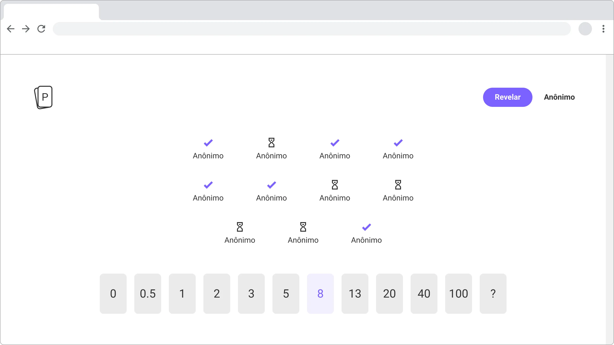

# Planning poker

> Ferramenta de planning poker gratuita e open-source.

Entenda e acompanhe pelo [Figma](https://www.figma.com/file/XhgXti6IjO5nrFVCA2hs0G/Poker-planning).

O projeto é divido em 2 partes; front-end e back-end.

## Front-end

É uma aplicação React. [Leia mais](./front-end).

## Back-end

É um servidor WebSocket. [Leia mais](./back-end).

## Licença

Apache-2.0 © 2021 Arthur Corenzan
