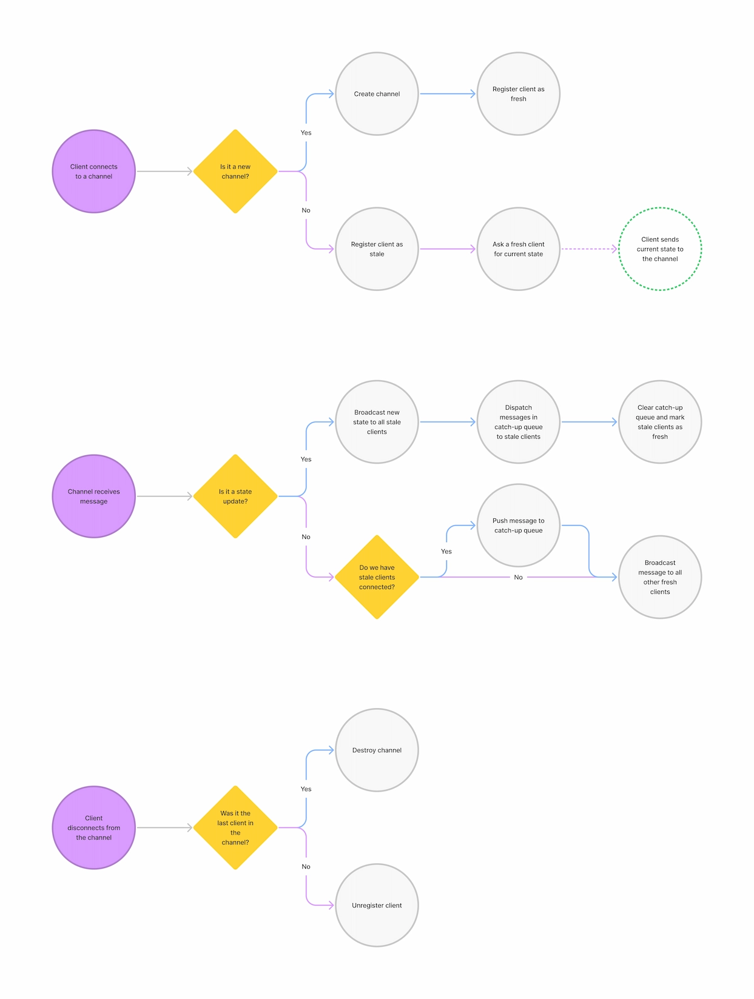

# Planning poker

O back-end é um servidor [WebSocket](https://developer.mozilla.org/en-US/docs/Web/API/WebSocket) de [broadcasting](<https://en.wikipedia.org/wiki/Broadcasting_(networking)>) com algumas regras extras para faciliar sincronia de estado dos clientes conectados.

Veja também [o front-end](../front-end/README.md).

## Tecnologia

- [TypeScript](https://www.typescriptlang.org/)
- [ws](https://github.com/websockets/ws)

## Licença

Apache-2.0 © 2021 Arthur Corenzan
