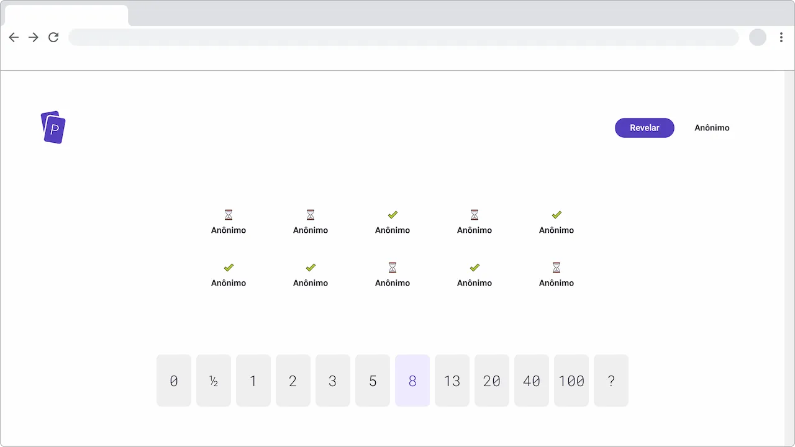

# Planning poker

O front-end é uma aplicação [React](https://reactjs.org/).

Veja também [o back-end](../back-end/README.md).

## Tecnologia

- [TypeScript](https://www.typescriptlang.org/)
- [Create React App](https://create-react-app.dev/)
- [wouter](https://github.com/molefrog/wouter)
- [immutability-helper](https://github.com/kolodny/immutability-helper)
- [modern-normalize](https://github.com/sindresorhus/modern-normalize)
- [nanoid](https://github.com/ai/nanoid)

## Licença

Apache-2.0 © 2021 Arthur Corenzan
